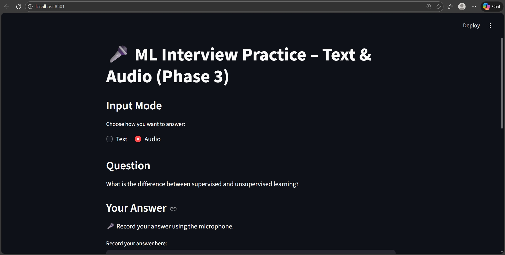
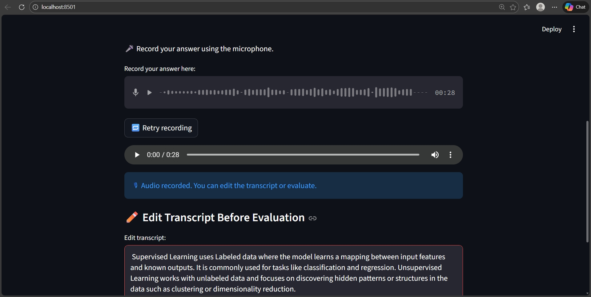
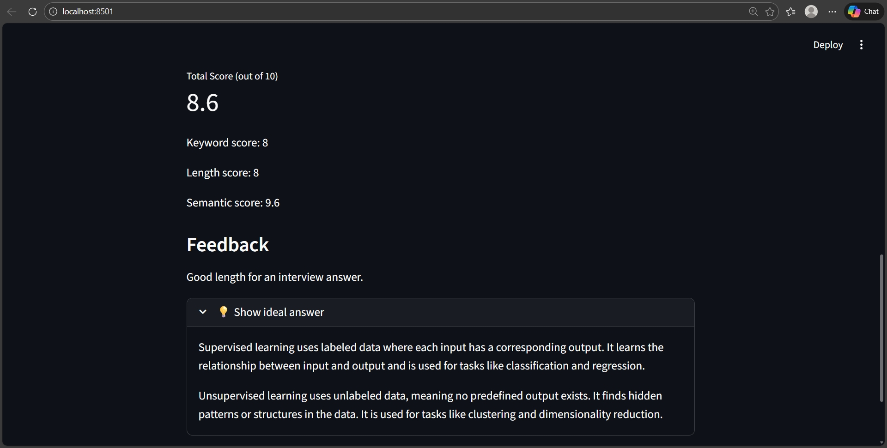

# 🎤 AI Interview Practice App

An AI-powered mock interview application that helps students and job seekers
practice **Machine Learning interview questions** by evaluating their answers
using **NLP, semantic similarity, and speech-to-text (Whisper)**.

This project simulates a real interview experience by providing instant scoring,
feedback, and ideal answers.

---

## 🚀 Key Features

- One-question-at-a-time **mock interview flow**
- Supports **text-based and audio-based answers**
- Converts speech to text using **OpenAI Whisper**
- Allows users to **edit the transcript before evaluation**
- Evaluates answers using:
  - Keyword matching
  - Answer length heuristics
  - **Semantic similarity (Sentence Transformers)**
- Generates:
  - Final score (out of 10)
  - Keyword, length, and semantic scores
  - Actionable feedback
  - Missing key concepts
- Clean and interactive UI built with **Streamlit**

---

## 🧠 How the System Works

1. A Machine Learning interview question is shown to the user.
2. The user answers using **text or voice**.
3. If audio is used:
   - Speech is converted to text using **Whisper**
   - The transcript can be edited by the user.
4. The final answer is evaluated using:
   - Keyword presence
   - Semantic similarity with the ideal answer
   - Answer length quality
5. The app displays:
   - Final score
   - Feedback
   - Missing important points
   - Ideal answer for comparison

---

## 🛠 Tech Stack

- **Python**
- **Streamlit** – interactive web application
- **Whisper (OpenAI)** – speech-to-text
- **Sentence Transformers** – semantic similarity scoring
- **NLP preprocessing** – text normalization and keyword extraction
- **Session State** – smooth navigation and state management

---

## 📂 Project Structure
```
AI-Interview-Practice-App/
│
├── AI_app.py # Streamlit UI + application logic
├── evaluation.py # Keyword, length, and semantic scoring
├── questions.py # Question bank with ideal answers & keywords
├── test_evaluate.py # Script to test evaluation logic independently
├── images/ # App screenshots
└── README.md # Project documentation
```

---

## ▶️ How to Run the Project Locally

1. Clone the repository:
```bash
git clone https://github.com/Sarumathi17/AI-Interview-Practice-App.git
```
2. Navigate to the project folder:
```bash
cd AI-Interview-Practice-App
```
3. Install dependencies:
```bash
pip install -r requirements.txt
```
4. Run the application:
```bash
streamlit run app.py
```
5. Open the browser URL shown in the terminal

---

## 📸 App Screenshots

### 🏠 Home Screen


### ✅ Answer Evaluation


### 💡 Ideal Answer View



---

## 🧩 What I Learned From This Project

- Integrating speech-to-text (Whisper) in a real application
- Designing explainable AI scoring systems
- Combining rule-based NLP with semantic embeddings
- Managing complex UI state in Streamlit
- Debugging real-world issues (audio, FFmpeg, Windows compatibility)

---

## 🔮 Future Enhancements

- Confidence and fluency scoring from audio
- Progress tracking across multiple attempts
- HR and behavioral interview questions
- Deployment on Streamlit Cloud

---

## 📌 Why This Project?

Most interview-prep tools focus on static content.  
This project focuses on **active practice**, **instant feedback**, and **learning by comparison**, making it a practical AI-assisted interview coaching tool.

---

## 🙌 Author

Developed by **Sarumathi M**  
*(Data Science & Machine Learning Enthusiast)*
