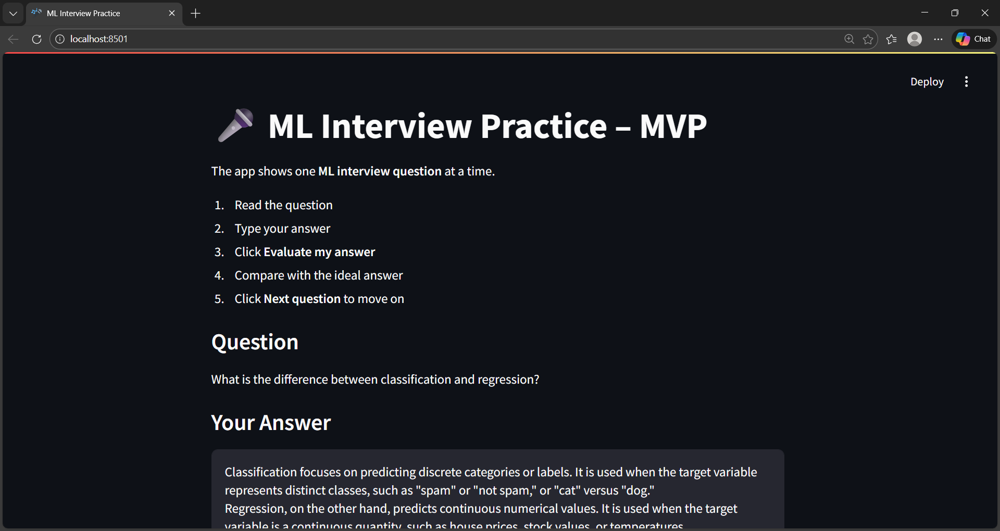
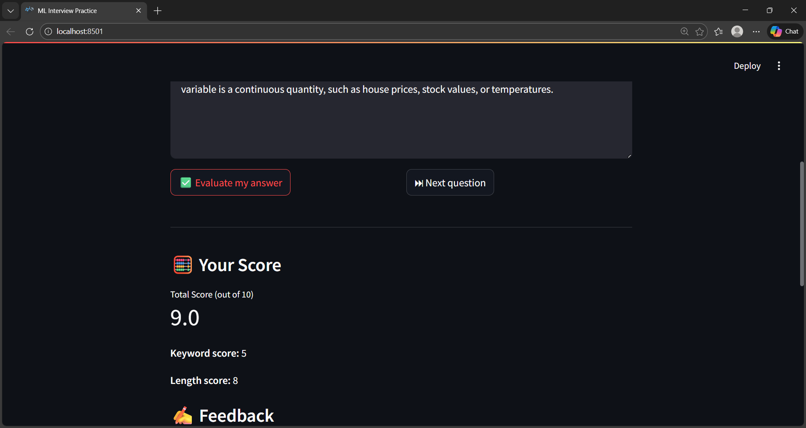
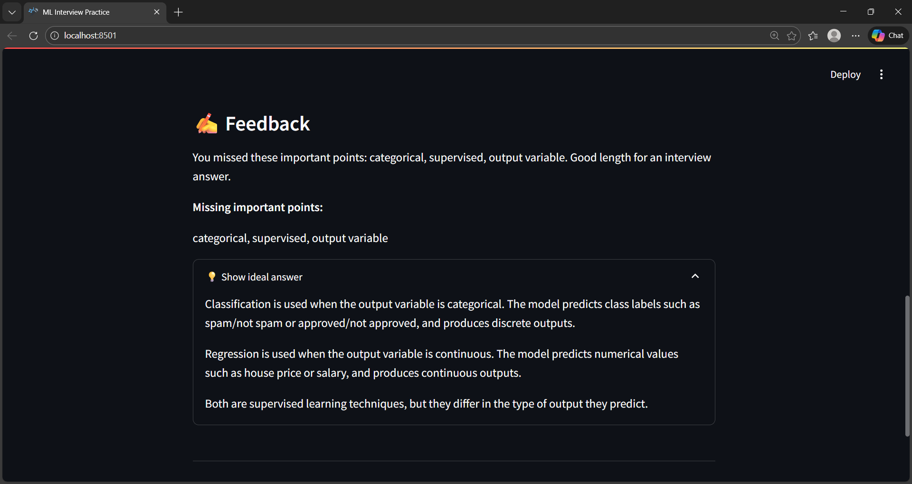

# 🎤 AI Interview Practice App (MVP | Phase 2 in Progress)

An AI-powered mock interview web application that helps students and job seekers practice **Machine Learning interview questions** by evaluating their answers and providing instant feedback.

Built as an MVP using **Streamlit** and a **custom NLP-based evaluation engine**, with **audio-based answer support currently under development in Phase 2**.


---

## 🚀 Features

- Presents **one ML interview question at a time** (mock interview style)
- Accepts **text-based answers** from users (MVP)
- Phase 2: **Audio-based answers using in-browser microphone recording** (in progress)
- Automatically evaluates answers using:
  - keyword matching
  - length-based heuristics
- Generates:
  - total score (out of 10)
  - keyword score and length score
  - detailed feedback
  - missing important points
- Allows users to **compare their answer with an ideal answer**
- Smooth navigation with **Next Question** functionality
- Simple, clean, and interactive UI


---

## 🧠 How the App Works (High-Level Flow)

1. Loads a structured question bank containing:
   - question text
   - ideal answers
   - important keywords
2. Displays one question to the user at a time.
3. User types an answer in the text box.
4. On clicking **Evaluate**:
   - the answer is preprocessed
   - important keywords are detected
   - a score is calculated
   - feedback is generated
5. The user can compare their answer with the ideal answer.
6. Clicking **Next Question** moves to the next interview question.
7. (Phase 2) Users can also record spoken answers, which are converted to text via a placeholder Speech-to-Text (STT) layer before evaluation.

---

## 🛠 Tech Stack

- **Python**
- **Streamlit** – for building the interactive web UI
- **NLP preprocessing** – text normalization and keyword extraction
- **Session State** – to manage question flow and preserve user input
- Modular design using:
  - `app.py` – UI and flow control
  - `questions.py` – question bank
  - `evaluation.py` – answer evaluation logic
- **Audio Input Pipeline** – in-browser microphone recording (Phase 2)
- **Speech-to-Text (STT)** – placeholder layer designed for future Whisper integration

---

## 📂 Project Structure
```
AI-Interview-Practice-App/
│
├── images/
│   ├── home.jpg
│   ├── evaluation.jpg
│   └── ideal_answer.jpg
│
├── AI_app.py            # Streamlit web application (UI + flow control)
├── questions.py         # Question bank with questions, ideal answers & keywords
├── evaluation.py        # NLP-based answer evaluation and scoring logic
├── test_evaluate.py     # Script to test evaluation logic independently
└── README.md            # Project documentation
```

---

## ▶️ How to Run the Project Locally

1. Clone the repository:
```bash
git clone https://github.com/Sarumathi17/AI-Interview-Practice-App.git
```
2. Navigate to the project folder:
```bash
cd AI-Interview-Practice-App
```
3. Install dependencies:
```bash
pip install streamlit
```
4. Run the application:
```bash
streamlit run app.py
```
5. Open the browser URL shown in the terminal

---

## 📸 App Screenshots

### 🏠 Home Screen


### ✅ Answer Evaluation


### 💡 Ideal Answer View


---

## ✅ Current Scope

- Text-based answer evaluation (stable MVP)
- Machine Learning interview questions
- Rule-based, explainable scoring
- Audio recording pipeline implemented in **Phase 2 branch** (STT placeholder)

---

## 🔮 Future Enhancements

- 🎙 Audio-based answers using Speech-to-Text (architecture ready, transcription integration pending)
- 🤖 Semantic similarity scoring using embeddings (SBERT / Transformers)
- 📊 Progress tracking and performance history
- 🧑‍💼 HR and behavioral interview questions
- 🌐 Deployment on cloud platforms

---

## 🧪 Development Status

- `main` branch: Stable text-based MVP
- `audio-phase2` branch: Audio recording support with placeholder transcription

The project follows a phased development approach using Git branches.

---

## 📌 Why This Project?

Most interview-prep tools focus on static content.  
This project focuses on **active practice**, **instant feedback**, and **learning by comparison**, making it a practical AI-assisted interview coaching tool.

---

## 🙌 Author

Developed by **Sarumathi M**  
*(Data Science & Machine Learning Enthusiast)*
